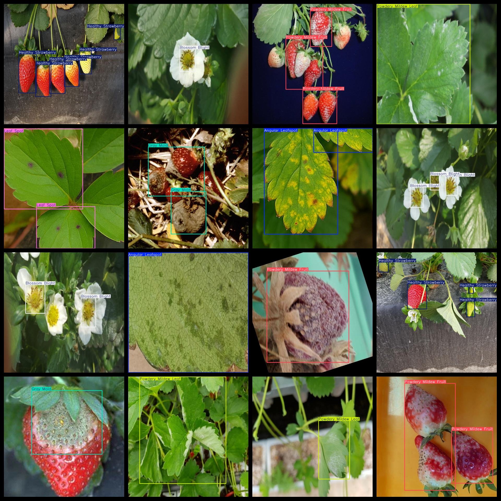
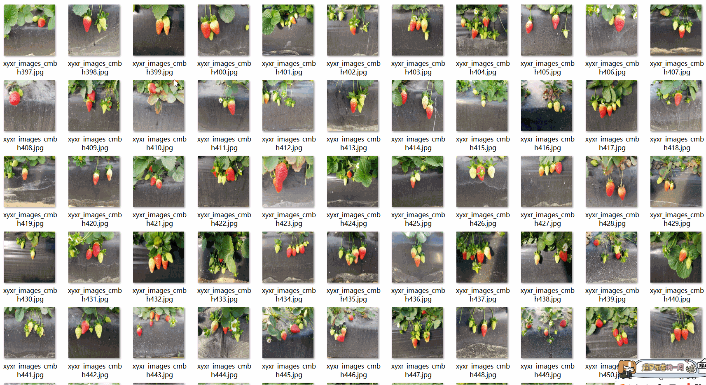

# [Object Detection] Strawberry Fruit and Leaf Disease Dataset - 5603 Images in YOLO+VOC Format

**[Object Detection]** Strawberry Fruit and Leaf Disease Dataset - 5603 Images in YOLO+VOC Format

The dataset format includes both VOC and YOLO formats. The zip file contains three folders, each storing images, XML files, and text files.

In the JPEGImages folder, there are a total of 5603jpg images.

In the Annotations folder, there are a total of 5603xml files.

And in the labels folder, there are a total of 5603txt files.

There are a total of 8 label categories: ["Angular Leafspot", "Anthracnose Fruit Rot", "Blossom Blight", "Gray Mold", "Healthy Strawberry", "Leaf Spot", "Powdery Mildew Fruit", "Powdery Mildew Leaf"]

The labels are as follows: [“angular spot”，“anthracnose fruit rot”，“wilted disease”，“smut”，“healthy strawberries”，“leaf spot”，“powdery mildew fruit”，“powdery mildew leaves”]

The number of bounding boxes (note that the order of classes in the YOLO format does not correspond to this, but is based on the classes.txt in the labels folder):

Angular Leafspot = 778

Anthracnose Fruit Rot = 1105

Blossom Blight = 981

Gray Mold = 763

Healthy Strawberry = 3268

Leaf Spot = 919

Powdery Mildew Fruit = 1106

Powdery Mildew Leaf = 1142

Total bounding box count = 10062

The image resolution is clear (pixel count).

The images have not been enhanced.

The shape of the labels is rectangular boxes, used for target detection identification.

Important Note: No guarantees are made regarding the accuracy or weights of the trained models using this dataset. The dataset only provides accurate and reasonable annotations.
## Images

---

Here is a pay link on Stripe (https://buy.stripe.com/3cs8yP7sY87d0vu9AB). Please contact me lonlonago@foxmail.com after funding $89, and I will send you a complete data files, thank you!

